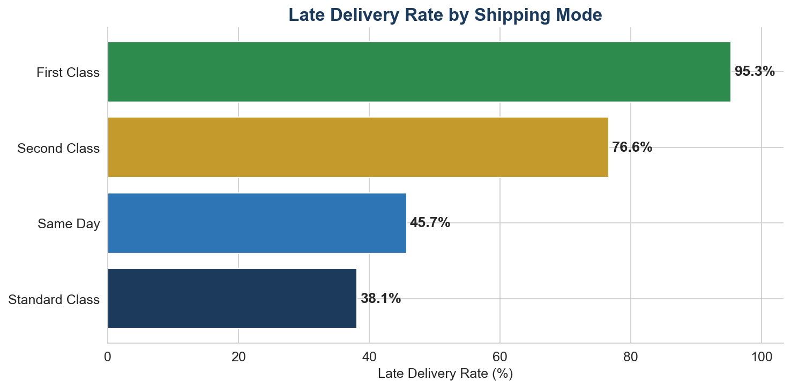
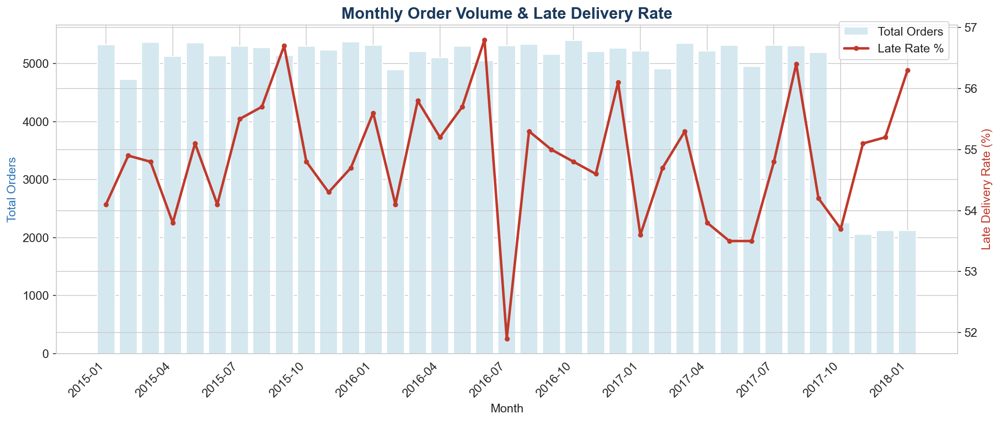

# 📦 Supply Chain Performance Analytics

## Business Problem

In industrial and logistics environments, late deliveries directly impact customer satisfaction, production schedules, and operational costs. This project analyzes **180,000+ supply chain orders** to identify the root causes of delivery delays and provide actionable recommendations for logistics optimization.

**Target industry:** Aerospace (Safran, Airbus), Industrial (Schneider Electric), Energy (Total)

---

## Dataset

**DataCo Smart Supply Chain** — [Kaggle](https://www.kaggle.com/datasets/shashwatwork/dataco-smart-supply-chain-for-big-data-analysis)

- **180,519 orders** across multiple markets and regions
- Features: order date, shipping date, delivery status, shipping mode, customer segment, product category, sales amount, profit, region
- Late delivery risk flag for each order

---

## Key Findings

- **54.8% of all orders** are flagged as late delivery risk
- **Standard Class** shipping has the highest delay rate at X% — significantly above Same Day
- Large orders (6+ items) show **+42% higher delay rate** than small orders (1-3 items)
- **Western Europe** and **Central America** are the most impacted regions
- Monthly trend analysis reveals seasonal peaks in delays during Q4

---

## Tech Stack

| Tool | Usage |
|------|-------|
| **Python** | Data exploration, cleaning, visualization (pandas, seaborn, matplotlib) |
| **SQL (SQLite)** | Advanced analytics: Window Functions, CTEs, aggregations |
| **Jupyter Notebook** | Interactive analysis and documentation |

---

## SQL Highlights

- **Window Functions:** `RANK() OVER()` for region delay ranking
- **CTEs:** Monthly time-series analysis of delay evolution
- **CASE WHEN:** Order size segmentation for volume/delay correlation
- **Multi-dimensional GROUP BY:** Shipping mode × customer segment cross-analysis

---

## Project Structure

```
supply-chain-analytics/
├── README.md
├── data/
│   └── supply_chain.db          ← SQLite database
├── sql/
│   └── supply_chain_analysis.sql ← 4+ commented queries
├── notebooks/
│   ├── 01_exploration.ipynb      ← EDA & cleaning
│   └── 02_visualizations.ipynb   ← Charts & insights
└── visuals/
    ├── late_rate_by_shipping.png
    ├── heatmap_mode_segment.png
    ├── monthly_trend.png
    └── top_regions.png
```

---

## Visualizations





---

## How to Run

```bash
# Install dependencies
pip install pandas seaborn matplotlib jupyter

# Launch notebook
jupyter notebook notebooks/01_exploration.ipynb
```

---

## Author

**Kawtar Barouti** — Data Analyst / Analytics Engineer  
[Back to Portfolio](../README.md)
